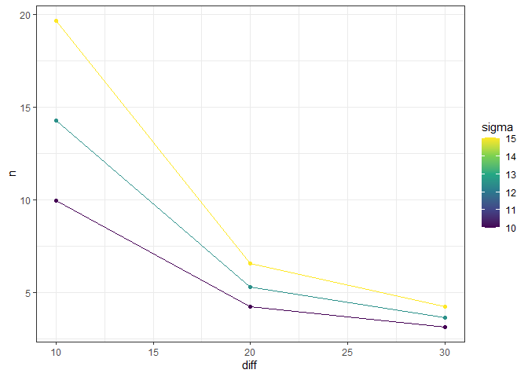
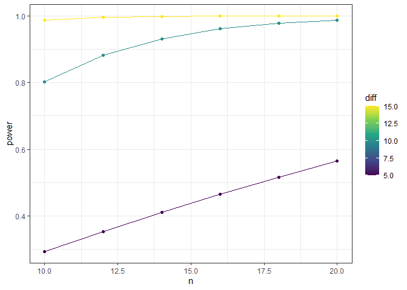

<!-- README.md is generated from README.Rmd. Please edit that file -->

# powder

**Author:** [Andree Valle Campos](https://twitter.com/avallecam)
<a href="https://orcid.org/0000-0002-7779-481X" target="orcid.widget">
<image class="orcid" src="https://members.orcid.org/sites/default/files/vector_iD_icon.svg" height="16"></a>
<br/> **License:** [MIT](https://opensource.org/licenses/MIT)<br/>

<!-- badges: start -->

[](https://www.tidyverse.org/lifecycle/#experimental)
[](https://cran.r-project.org/package=powder)
<!-- badges: end -->

## Overview

The goal of `powder` is to complement **power** and **sample size**
calculations:

  - for more than one set of parameters, and

  - create tidy output tables and plots from them.

## Installation

You can install the developing version of `powder` using:

``` r
if(!require("devtools")) install.packages("devtools")
devtools::install_github("avallecam/powder")
```

<!--

You can install the released version of powder from [CRAN](https://CRAN.R-project.org) with:

``` r
install.packages("powder")
```

-->

## Structure

`powder` consist of three main functions:

  - `pwr_grid`: creates a tibble from all combination of input
    parameters using `tidyr::expand_grid`.

  - `pwr_tidy`: creates a `broom::tidy()` output from the calculations
    of all input parameters using `purrr::pmap`.

  - `pwr_plot`: create a `ggplot` with input parameters and calculated
    value (sample size, power or effect size)

## Example

This is a basic example which shows you how to solve a common problem:

``` r
library(tidyverse)
library(magrittr)
library(knitr)
library(broom)
library(pwr)
library(powder)
```

### One set of parameters

``` r
diff <- 10
sigma <- 10
delta <- diff/sigma

pwr.t.test(d = delta, power = 0.8, type = "one.sample")
#> 
#>      One-sample t test power calculation 
#> 
#>               n = 9.93785
#>               d = 1
#>       sig.level = 0.05
#>           power = 0.8
#>     alternative = two.sided
# sample - power plot
#pwr.t.test(d = delta, power = 0.8, type = "one.sample") %>% plot()
```

### More than one set of parameters

#### sample size

``` r
# stata
# power onemean 20, diff(10 20 30) sd(10 12.5 15)
eg1 <- pwr_grid(n = NULL,
                diff = c(10,20,30),
                sigma = c(10,12.5,15),
                d = NULL,
                sig.level = 0.05,
                power = 0.8,
                type = "one.sample",
                alternative = "two.sided")

#create tidytable
eg1 %>% pwr_tidy(test_function = pwr.t.test)
```

<div class="kable-table">

| diff | sigma | sig.level | power | type       | alternative |     delta | query |         n |
| ---: | ----: | --------: | ----: | :--------- | :---------- | --------: | :---- | --------: |
|   10 |  10.0 |      0.05 |   0.8 | one.sample | two.sided   | 1.0000000 | n     |  9.937850 |
|   10 |  12.5 |      0.05 |   0.8 | one.sample | two.sided   | 0.8000000 | n     | 14.302765 |
|   10 |  15.0 |      0.05 |   0.8 | one.sample | two.sided   | 0.6666667 | n     | 19.666949 |
|   20 |  10.0 |      0.05 |   0.8 | one.sample | two.sided   | 2.0000000 | n     |  4.220726 |
|   20 |  12.5 |      0.05 |   0.8 | one.sample | two.sided   | 1.6000000 | n     |  5.279930 |
|   20 |  15.0 |      0.05 |   0.8 | one.sample | two.sided   | 1.3333333 | n     |  6.581163 |
|   30 |  10.0 |      0.05 |   0.8 | one.sample | two.sided   | 3.0000000 | n     |  3.144009 |
|   30 |  12.5 |      0.05 |   0.8 | one.sample | two.sided   | 2.4000000 | n     |  3.638924 |
|   30 |  15.0 |      0.05 |   0.8 | one.sample | two.sided   | 2.0000000 | n     |  4.220726 |

</div>

``` r

#create ggplot
eg1 %>%
  pwr_tidy(test_function = pwr.t.test) %>%
  pwr_plot(x = diff,y = n,group = sigma)
```



#### power

``` r
# stata
# power onemean 20, diff(5 (5) 15) sd(10) n(10 (2) 20)
eg2 <- pwr_grid(n = seq(from = 10,to = 20,by = 2),
                diff = seq(from = 5,to = 15,by = 5),
                sigma = 10,
                d = NULL,
                sig.level = 0.05,
                #power = 0.8,
                type = "one.sample",
                alternative = "two.sided")

#create tidytable
eg2 %>% pwr_tidy(test_function = pwr.t.test)
```

<div class="kable-table">

|  n | diff | sigma | sig.level | type       | alternative | delta | query |     power |
| -: | ---: | ----: | --------: | :--------- | :---------- | ----: | :---- | --------: |
| 10 |    5 |    10 |      0.05 | one.sample | two.sided   |   0.5 | power | 0.2931756 |
| 10 |   10 |    10 |      0.05 | one.sample | two.sided   |   1.0 | power | 0.8030969 |
| 10 |   15 |    10 |      0.05 | one.sample | two.sided   |   1.5 | power | 0.9872769 |
| 12 |    5 |    10 |      0.05 | one.sample | two.sided   |   0.5 | power | 0.3528241 |
| 12 |   10 |    10 |      0.05 | one.sample | two.sided   |   1.0 | power | 0.8828916 |
| 12 |   15 |    10 |      0.05 | one.sample | two.sided   |   1.5 | power | 0.9969653 |
| 14 |    5 |    10 |      0.05 | one.sample | two.sided   |   0.5 | power | 0.4102363 |
| 14 |   10 |    10 |      0.05 | one.sample | two.sided   |   1.0 | power | 0.9323695 |
| 14 |   15 |    10 |      0.05 | one.sample | two.sided   |   1.5 | power | 0.9993203 |
| 16 |    5 |    10 |      0.05 | one.sample | two.sided   |   0.5 | power | 0.4648700 |
| 16 |   10 |    10 |      0.05 | one.sample | two.sided   |   1.0 | power | 0.9618851 |
| 16 |   15 |    10 |      0.05 | one.sample | two.sided   |   1.5 | power | 0.9998552 |
| 18 |    5 |    10 |      0.05 | one.sample | two.sided   |   0.5 | power | 0.5163650 |
| 18 |   10 |    10 |      0.05 | one.sample | two.sided   |   1.0 | power | 0.9789598 |
| 18 |   15 |    10 |      0.05 | one.sample | two.sided   |   1.5 | power | 0.9999704 |
| 20 |    5 |    10 |      0.05 | one.sample | two.sided   |   0.5 | power | 0.5645044 |
| 20 |   10 |    10 |      0.05 | one.sample | two.sided   |   1.0 | power | 0.9885913 |
| 20 |   15 |    10 |      0.05 | one.sample | two.sided   |   1.5 | power | 0.9999941 |

</div>

``` r

#create ggplot
eg2 %>%
  pwr_tidy(test_function = pwr.t.test) %>%
  pwr_plot(x = n,y = power,group=diff)
```



#### flexible with different `pwr` functions

``` r
#example("pwr.2p.test")
pwr.2p.test(h=0.3,n=80,sig.level=0.05,alternative="greater")
#> 
#>      Difference of proportion power calculation for binomial distribution (arcsine transformation) 
#> 
#>               h = 0.3
#>               n = 80
#>       sig.level = 0.05
#>           power = 0.5996777
#>     alternative = greater
#> 
#> NOTE: same sample sizes

pwr_grid(h=0.3,n=seq(80,90,5),sig.level=0.05,alternative="greater") %>% 
  pwr_tidy(test_function = pwr.2p.test)
```

<div class="kable-table">

|  n |   h | sig.level | alternative | query |     power |
| -: | --: | --------: | :---------- | :---- | --------: |
| 80 | 0.3 |      0.05 | greater     | power | 0.5996777 |
| 85 | 0.3 |      0.05 | greater     | power | 0.6220644 |
| 90 | 0.3 |      0.05 | greater     | power | 0.6434171 |

</div>

``` r

pwr_grid(h=seq(0.3,0.5,0.1),n=seq(80,90,5),sig.level=0.05,alternative="greater") %>% 
  pwr_tidy(test_function = pwr.2p.test)
```

<div class="kable-table">

|  n |   h | sig.level | alternative | query |     power |
| -: | --: | --------: | :---------- | :---- | --------: |
| 80 | 0.3 |      0.05 | greater     | power | 0.5996777 |
| 80 | 0.4 |      0.05 | greater     | power | 0.8119132 |
| 80 | 0.5 |      0.05 | greater     | power | 0.9354202 |
| 85 | 0.3 |      0.05 | greater     | power | 0.6220644 |
| 85 | 0.4 |      0.05 | greater     | power | 0.8321829 |
| 85 | 0.5 |      0.05 | greater     | power | 0.9468173 |
| 90 | 0.3 |      0.05 | greater     | power | 0.6434171 |
| 90 | 0.4 |      0.05 | greater     | power | 0.8504646 |
| 90 | 0.5 |      0.05 | greater     | power | 0.9562975 |

</div>

## References

Stephane Champely (2018). pwr: Basic Functions for Power Analysis. R
package version 1.2-2. <https://CRAN.R-project.org/package=pwr>

## Citation

``` r
citation("powder")
#> 
#> To cite package 'powder' in publications use:
#> 
#>   Andree Valle-Campos (2020). powder: A Tidy Extension for Power
#>   Analysis. R package version 0.0.0.9000.
#>   https://avallecam.github.io/powder/
#> 
#> A BibTeX entry for LaTeX users is
#> 
#>   @Manual{,
#>     title = {powder: A Tidy Extension for Power Analysis},
#>     author = {Andree Valle-Campos},
#>     year = {2020},
#>     note = {R package version 0.0.0.9000},
#>     url = {https://avallecam.github.io/powder/},
#>   }
```
